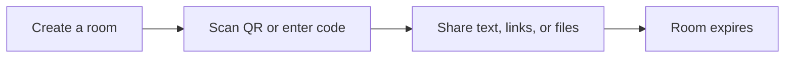

# LoopFlow

**Move text, links, and files between devices—then forget the room.**

[Open LoopFlow](https://loopfloww.vercel.app/) · [How it works](#how-it-works) · [Run locally](#run-locally)



No account required. Rooms support files and folders up to **50 MiB per file**, transfer progress, and lifetimes from **10 minutes to 2 hours**. LoopFlow uses a local server for LAN transfers when available, or Firebase for internet rooms.

## How it works

1. Create a room on either device.
2. Join from the other device with its QR code or six-digit code.
3. Send text, links, or files. Download items individually or as a ZIP.

## Run locally

For a quick transfer on one Wi-Fi network, install **Node.js 20+** and run:

```bash
node lan-server.js
```

Open [http://localhost:3847](http://localhost:3847) on the host, then scan the room QR code with the other device. Allow Node through the firewall if prompted. Set `LOOPFLOW_PORT` to change the port.

LAN rooms live in server memory and are cleared when they expire or the server restarts. The server serves the app too, so use its HTTP address rather than opening `index.html` directly.

## Internet rooms (Firebase)

To use Firebase, create a project with **Anonymous Authentication**, **Cloud Firestore**, and **Storage** enabled. Add its web config to `firebase.js`, review the rules, and deploy the site from an authorized HTTPS origin. Firebase Hosting is configured in `firebase.json`; `/chat` is rewritten to `chat.html` for both Firebase Hosting and Vercel.

If Storage uploads fail due to CORS, apply `cors.json` with `gcloud storage buckets update gs://YOUR_BUCKET_NAME --cors-file=cors.json`. Restrict the checked-in policy to your site origins before production use.

<details>
<summary>Firebase setup and deployment commands</summary>

```bash
firebase deploy --only hosting
firebase deploy --only firestore:rules,storage
```

Both devices must use the same deployed app and Firebase project. The app tries a companion LAN server first, then Firebase. When Firebase is unavailable, some screens may show a local demo; that is not a shared room.
</details>

## Security and data lifetime

> **Deployment warning:** `firestore.rules` currently allows all reads and writes until **October 12, 2026**. Replace it with rules scoped to authenticated users and room membership before deploying or before that date. Do not deploy with this temporary rule.

Room codes are short identifiers, not strong access controls. Firebase room data is stored in your project and is not end-to-end encrypted; anyone with room access can read its contents. LAN data stays in server memory. Firebase rules do not delete expired data automatically, so configure cleanup if you need cloud data removed.

## Project map

| Area | Files |
| --- | --- |
| Pages and interface | `index.html`, `chat.html`, `about.html`, `styles.css`, `app.js` |
| Rooms and transfers | `room.js`, `storage.js`, `webrtc.js`, `chat.js`, `utils.js` |
| LAN server | `lan-server.js`, `lan.js` |
| Firebase and hosting | `firebase.js`, `firebase.json`, `vercel.json` |
| Access, offline install | `firestore.rules`, `storage.rules`, `cors.json`, `service-worker.js`, `manifest.json` |

## Need help?

- **QR link won’t open:** Check both devices are on the same network and the host firewall allows port `3847`. Guest Wi-Fi may block device-to-device connections.
- **Firebase room won’t open:** Check Anonymous Authentication, authorized domains, and Firestore rules.
- **Upload fails:** Check Storage setup, rules, and bucket CORS. Firebase may use a Firestore fallback, subject to its rules and quotas.
