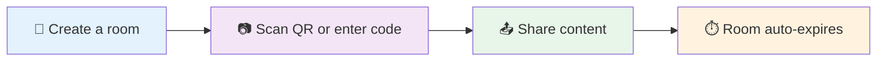

<div align="center">

# 🔄 LoopFlow

### Move text, links, and files between devices—then forget the room.

[](https://loopfloww.vercel.app/)
[](https://nodejs.org/)
[](https://firebase.google.com/)
[](LICENSE)

**No accounts • No tracking • Temporary rooms • QR code sharing**

[✨ Features](#-features) • [🚀 Quick Start](#-quick-start) • [📖 Documentation](#-how-it-works) • [🛠️ Setup](#-deployment-options) • [❓ FAQ](#-faq)

</div>

---

## ✨ Features



### 🎯 Core Features

- **🔒 No Account Required** - Start sharing instantly without sign-ups
- **📦 File & Folder Support** - Transfer files up to 50 MiB per file
- **📊 Transfer Progress** - Real-time upload/download progress tracking
- **⏱️ Flexible Room Lifetimes** - Choose from 10 minutes to 2 hours
- **📱 QR Code Sharing** - Instantly join rooms by scanning QR codes
- **🔢 Six-Digit Codes** - Simple manual room codes as an alternative
- **💾 Batch Downloads** - Download all room content as a single ZIP file
- **🌐 Dual Mode** - Works on LAN (local network) or internet (via Firebase)
- **📲 PWA Support** - Install as a standalone app on mobile/desktop
- **🎨 Clean Interface** - Simple, intuitive design that gets out of your way

### 🔐 Privacy & Security

- **Temporary by design** - Rooms auto-delete after expiration
- **No persistent storage** - LAN mode keeps data only in memory
- **Local-first** - Prioritizes LAN connections when available
- **Minimal data collection** - No tracking, no analytics, no user profiles

---

## 🚀 Quick Start

### Option 1: Use the Hosted Version

Visit **[loopfloww.vercel.app](https://loopfloww.vercel.app/)** and start sharing immediately.

### Option 2: Run on Your Local Network (Recommended)

Perfect for quick transfers between devices on the same Wi-Fi network:

#### Prerequisites

- **Node.js 20+** ([Download here](https://nodejs.org/))

#### Steps

1. **Download or clone this repository**
   ```bash
   git clone https://github.com/yourusername/LoopFlow.git
   cd LoopFlow
   ```

2. **Start the LAN server**
   ```bash
   node lan-server.js
   ```

3. **Open on host device**
   
   Navigate to [http://localhost:3847](http://localhost:3847)

4. **Join from other device(s)**
   
   Scan the QR code or enter the six-digit room code

5. **Start sharing!**

> **💡 Tip:** Allow Node.js through your firewall if prompted. The server runs on port `3847` by default. Change it with the `LOOPFLOW_PORT` environment variable.

**Example with custom port:**
```bash
# Windows PowerShell
$env:LOOPFLOW_PORT=8080; node lan-server.js

# macOS/Linux
LOOPFLOW_PORT=8080 node lan-server.js
```

---

## 📖 How It Works

### The Simple Flow

1. **Create a Room** - One device creates a temporary room with a unique six-digit code
2. **Share the Code** - Display a QR code or manually share the six-digit code
3. **Join & Transfer** - Other device(s) join and start sharing content
4. **Auto-Cleanup** - Room expires and all data is deleted automatically

### Connection Modes

| Mode | Use Case | Data Storage | Speed | Setup Required |
|------|----------|--------------|-------|----------------|
| **🏠 LAN** | Same Wi-Fi network | Server memory | Fastest | Just run `node lan-server.js` |
| **🌐 Firebase** | Internet/Different networks | Cloud Firestore | Fast | Firebase project setup |
| **🔗 WebRTC** | Direct peer-to-peer | Client devices | Variable | Automatic fallback |

---

## 🛠️ Deployment Options

### LAN Server (Local Network)

**Best for:** Quick, private transfers on your home or office network

**Features:**
- ⚡ Fastest transfer speeds
- 🔒 Data stays on your network
- 💾 Zero cloud storage costs
- 🚫 No internet dependency

**How it works:**
- Rooms stored in server memory
- Cleared on expiration or server restart
- Serves the web app at `http://localhost:3847`
- Accessible to devices on the same network

**Important:** Use the server's HTTP address, not `file://` (don't open `index.html` directly).

---

### Firebase (Internet Rooms)

**Best for:** Sharing across different networks or locations

#### Initial Setup

1. **Create a Firebase project** at [console.firebase.google.com](https://console.firebase.google.com/)

2. **Enable required services:**
   - ✅ Authentication → Anonymous Authentication
   - ✅ Firestore Database → Create database
   - ✅ Storage → Create storage bucket

3. **Configure the app:**
   
   Add your Firebase config to `firebase.js`:
   ```javascript
   const firebaseConfig = {
     apiKey: "YOUR_API_KEY",
     authDomain: "YOUR_PROJECT.firebaseapp.com",
     projectId: "YOUR_PROJECT_ID",
     storageBucket: "YOUR_PROJECT.appspot.com",
     messagingSenderId: "YOUR_SENDER_ID",
     appId: "YOUR_APP_ID"
   };
   ```

4. **Update security rules:**
   
   ⚠️ **CRITICAL:** Replace the temporary rules in `firestore.rules` before deploying! The default rules expire on **October 12, 2026** and allow unrestricted access.

5. **Fix CORS for Storage (if needed):**
   ```bash
   gcloud storage buckets update gs://YOUR_BUCKET_NAME --cors-file=cors.json
   ```
   
   **Security note:** Update `cors.json` with your actual domain before production use.

#### Deployment

**Option A: Firebase Hosting**
```bash
# Install Firebase CLI
npm install -g firebase-tools

# Login
firebase login

# Deploy hosting
firebase deploy --only hosting

# Deploy database rules
firebase deploy --only firestore:rules,storage
```

**Option B: Vercel**
```bash
# Install Vercel CLI
npm install -g vercel

# Deploy
vercel

# Or deploy via GitHub integration
```

**Option C: Any Static Host**

Upload all files to your hosting provider. Ensure:
- `/chat` route rewrites to `/chat.html`
- HTTPS is enabled
- Your domain is added to Firebase authorized domains

#### Connection Behavior

The app intelligently chooses the best connection method:

1. **First:** Tries LAN server (if available)
2. **Then:** Falls back to Firebase
3. **Finally:** Shows local demo if neither is available

> Both devices must use the same deployed app and Firebase project to share a room.

---

## 🔐 Security Considerations

### ⚠️ Important Security Notes

1. **Room Codes Are Not Passwords**
   - Six-digit codes are convenience features, not security controls
   - Anyone with the code can access the room
   - Use rooms only for temporary, non-sensitive data

2. **Data Encryption**
   - ❌ Firebase data is **NOT end-to-end encrypted**
   - ✅ LAN data stays in memory (not written to disk)
   - ✅ HTTPS encrypts data in transit (on hosted versions)

3. **Firebase Rules**
   - 🚨 Default rules expire **October 12, 2026**
   - 🚨 Default rules allow unrestricted access
   - ✅ Implement proper authentication-scoped rules before deploying
   - ✅ Configure automatic cleanup for expired rooms

4. **Data Lifetime**
   - LAN: Auto-deleted on expiration or server restart
   - Firebase: Requires manual cleanup configuration
   - Consider Cloud Functions for automatic deletion

### 🛡️ Recommended Security Rules

Replace `firestore.rules` with production-ready rules:

```javascript
rules_version = '2';
service cloud.firestore {
  match /databases/{database}/documents {
    // Only authenticated users can access rooms
    match /rooms/{roomId} {
      allow read, write: if request.auth != null 
                         && request.time < resource.data.expiresAt;
    }
    
    match /rooms/{roomId}/messages/{messageId} {
      allow read, write: if request.auth != null;
    }
  }
}
```

---

## 🏗️ Project Structure

### 📂 Core Files

```
LoopFlow/
├── 🌐 Web Pages
│   ├── index.html          # Landing page (create/join room)
│   ├── chat.html           # Room interface (send/receive)
│   ├── about.html          # About page
│   └── styles.css          # Global styles
│
├── ⚙️ Application Logic
│   ├── app.js              # Main app controller
│   ├── room.js             # Room management (Firebase)
│   ├── chat.js             # Chat/message handling
│   ├── storage.js          # File upload/download (Firebase)
│   ├── lan.js              # LAN server client
│   ├── webrtc.js           # WebRTC peer connections
│   └── utils.js            # Helper functions
│
├── 🖥️ LAN Server
│   └── lan-server.js       # Local network server
│
├── ☁️ Firebase
│   ├── firebase.js         # Firebase initialization
│   ├── firebase.json       # Firebase hosting config
│   ├── firestore.rules     # Database security rules
│   ├── storage.rules       # Storage security rules
│   └── cors.json           # Storage CORS policy
│
├── 📱 PWA
│   ├── manifest.json       # App manifest
│   ├── service-worker.js   # Offline support
│   └── favicon.svg         # App icon
│
└── 🚀 Deployment
    ├── vercel.json         # Vercel configuration
    └── robots.txt          # SEO configuration
```

### 🔑 Key Components

| Component | Purpose | Dependencies |
|-----------|---------|--------------|
| **app.js** | UI coordination, mode detection | room.js, lan.js, storage.js, webrtc.js |
| **room.js** | Firebase room operations | firebase.js, Firestore SDK |
| **lan.js** | LAN server communication | Native fetch API |
| **storage.js** | File handling for Firebase | Firebase Storage SDK |
| **webrtc.js** | Direct peer connections | WebRTC API |
| **lan-server.js** | Local HTTP server | Node.js http, fs, os modules |

## Need help?

- **QR link won’t open:** Check both devices are on the same network and the host firewall allows port `3847`. Guest Wi-Fi may block device-to-device connections.
- **Firebase room won’t open:** Check Anonymous Authentication, authorized domains, and Firestore rules.
- **Upload fails:** Check Storage setup, rules, and bucket CORS. Firebase may use a Firestore fallback, subject to its rules and quotas.

---

## ❓ FAQ

<details>
<summary><strong>Can I use this without internet?</strong></summary>

Yes! Run the LAN server on your local network. Both devices must be on the same Wi-Fi network.

</details>

<details>
<summary><strong>What's the maximum file size?</strong></summary>

50 MiB per file. The server accepts up to 75 MB total to accommodate base64 encoding overhead.

</details>

<details>
<summary><strong>Are my files stored permanently?</strong></summary>

No. Files are automatically deleted when:
- The room expires (10 min - 2 hours)
- The LAN server restarts (LAN mode)
- Manual cleanup runs (Firebase mode - requires configuration)

</details>

<details>
<summary><strong>Can I share with more than 2 devices?</strong></summary>

Yes! Multiple devices can join the same room using the six-digit code. All participants can send and receive.

</details>

<details>
<summary><strong>Do I need to create an account?</strong></summary>

No accounts required. Firebase uses anonymous authentication behind the scenes, but you never sign up or log in.

</details>

<details>
<summary><strong>Which browsers are supported?</strong></summary>

Modern browsers with JavaScript enabled:
- ✅ Chrome/Edge 90+
- ✅ Firefox 88+
- ✅ Safari 14+
- ✅ Mobile browsers (iOS Safari, Chrome Android)

</details>

<details>
<summary><strong>Can I self-host this?</strong></summary>

Absolutely! You can:
1. Run the LAN server locally (no setup needed)
2. Deploy to your own Firebase project
3. Host on any static hosting (Vercel, Netlify, GitHub Pages, etc.)

</details>

---

## 🔧 Advanced Troubleshooting

### QR Code Won't Scan / Room Won't Connect (LAN Mode)

**Symptoms:** Mobile device can't reach the room after scanning QR code

**Solutions:**
1. ✅ Verify both devices are on the **same Wi-Fi network**
2. ✅ Check firewall settings - allow Node.js through Windows/Mac firewall
3. ✅ Disable AP Isolation on your router (common on guest networks)
4. ✅ Try manually entering the IP address: `http://192.168.x.x:3847`
5. ✅ Ensure port `3847` isn't blocked or in use

**Test connectivity:**
```bash
# On the mobile device, open browser and visit:
http://[server-ip]:3847/api/health
```

---

### Firebase Room Won't Open

**Symptoms:** Infinite loading, "Room not found", or connection errors

**Solutions:**
1. ✅ Enable **Anonymous Authentication** in Firebase Console
2. ✅ Add your domain to Firebase **Authorized Domains**
3. ✅ Check Firestore **security rules**
4. ✅ Verify `firebase.js` has correct project configuration

---

### File Upload Fails

**LAN Mode:**
- ✅ Check file is under 50 MiB
- ✅ Verify server is running

**Firebase Mode:**
- ✅ Enable Storage in Firebase Console
- ✅ Apply CORS: `gcloud storage buckets update gs://YOUR_BUCKET --cors-file=cors.json`

---

## 🛠️ Technology Stack

- **Frontend:** Vanilla JavaScript (ES6+), HTML5, CSS3
- **LAN Server:** Node.js (native modules, zero dependencies)
- **Backend:** Firebase (Firestore, Storage, Authentication)
- **Real-time:** Server-Sent Events (SSE), WebRTC
- **PWA:** Service Workers, Web App Manifest

---

## 🤝 Contributing

Contributions welcome! Bug fixes, features, or documentation improvements.

### Ideas for Contributions

- 🌍 Internationalization support
- 🎨 Theme customization
- 📊 Enhanced file preview
- 🔔 Desktop notifications
- ♿ Accessibility improvements

---

## 📄 License

MIT License - see [LICENSE](LICENSE) for details.

---

## 👤 Author

**Harshal** ([@harshhhhal](https://github.com/harshhhhal))

---

<div align="center">

**⭐ Star this repo if you find it useful!**

Made with ❤️ by developers, for developers

[🔝 Back to top](#-loopflow)

</div>

